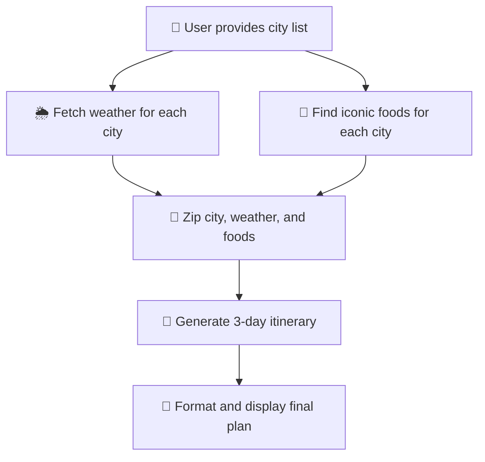

# 🍽️ City Foodie Tour Planner

Welcome to the **City Foodie Tour Planner**! This AI agent helps you plan a delightful, weather-aware foodie tour for any city. It fetches real-time weather, finds iconic local foods, and crafts a 3-day itinerary with fun facts and recommendations.

---

## 🚀 What Does This Agent Do?
- 🌦️ **Fetches real-time weather** for your chosen cities
- 🍲 **Finds the most iconic foods** in each city
- 🗺️ **Generates a 3-day itinerary** with morning, afternoon, and evening activities
- 🤩 **Adds fun local facts** to make your trip memorable

---

## 🛠️ How to Use
1. 📥 **Clone or download this repository.**
2. 🧩 **Install dependencies:**
   ```bash
   pip install julep pyyaml
   ```
3. 🔑 **Set your API keys** for OpenWeatherMap and Brave Search in the script.
4. ▶️ **Run the script:**
   ```bash
   python food_trip_planner.py
   ```
5. 🎉 **View your personalized foodie tour in the terminal!**

---

## 🧭 How Does It Work? (Visual Workflow)



---

## 🧠 Step-by-Step Workflow

### 1️⃣ **Input**
You provide a list of cities (e.g., `['Indore', 'Mumbai']`).

### 2️⃣ **Step 0: Fetch Weather Data**
```yaml
- over: $ steps[0].input.locations
  map:
    tool: weather
    arguments:
      location: $ _
  parallelism: 5
```
➡️ For each city, fetches the current weather using the OpenWeatherMap API. 🌦️

### 3️⃣ **Step 1: Find Iconic Foods**
```yaml
- over: $ steps[0].input.locations
  map:
    tool: internet_search
    arguments:
      query: $ 'most iconic foods are ' + _
  parallelism: 5
```
➡️ For each city, searches for the most iconic local foods using Brave Search. 🍲

### 4️⃣ **Step 2: Combine Data**
```yaml
- evaluate:
    zipped: |-
      $ list(
        zip(
          steps[0].input.locations,
          [output['result'] for output in steps[0].output],
          steps[1].output
        )
      )
```
➡️ Zips together the city name, weather, and iconic foods for each city. 🔗

### 5️⃣ **Step 3: Generate Itineraries**
```yaml
- over: $ _['zipped']
  parallelism: 3
  map:
    prompt:
    - role: system
      content: >-
        You are a travel expert creating a 3-day itinerary.
        For each location, you'll receive:
        - Weather conditions
        - Top tourist attractions
        Create a plan with:
        1. Morning activity
        2. Afternoon excursion
        3. Evening experience
        4. Fun local facts
    - role: user
      content: >-
        Location: "{{_[0]}}"
        Weather: "{{_[1]}}"
        Attractions: "{{_[2]}}"
    unwrap: true
```
➡️ For each city, the agent generates a 3-day foodie itinerary using the weather and food data. 🗺️

### 6️⃣ **Step 4: Format Final Output**
```yaml
- evaluate:
    final_plan: |-
      $ '\n---------------\n'.join([activity for activity in _])
```
➡️ Joins all itineraries into a single, easy-to-read output. 📝

---

## ✨ Example Output
```
---------------
🌍 Indore
Weather: Clear
🍴 Foods: Poha, Jalebi, Samosa
Day 1: ...
Day 2: ...
Day 3: ...
Fun Fact: ...
---------------
🌍 Mumbai
Weather: Rainy
🍴 Foods: Vada Pav, Pav Bhaji, Bhel Puri
Day 1: ...
Day 2: ...
Day 3: ...
Fun Fact: ...
```

---

## 📝 Customization
- 🏙️ **Change the list of cities** in the script input.
- 📝 **Modify the prompts** in the YAML to adjust the itinerary style.
- 🍽️ **Add more steps** (e.g., restaurant recommendations, event searches) for a richer experience.

---

## 💡 Why Use This Agent?
- 🤖 **Automates travel planning** with real-time data
- 🎯 **Personalizes recommendations** for each city
- 😋 **Fun and informative** for foodies and travelers alike

---

## 📬 Questions or Suggestions?
Open an issue or pull request—contributions are welcome!

---

Enjoy your culinary adventure! 🍲🍛🍜 
